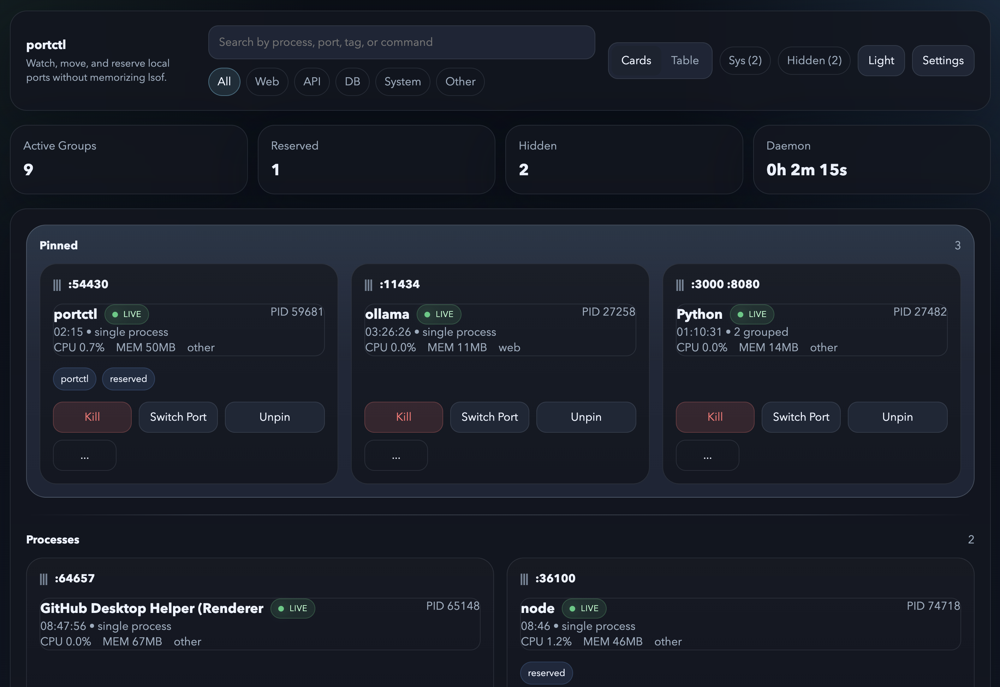

# portctl

[](https://www.typescriptlang.org/)
[](https://nodejs.org/)
[](https://www.apple.com/macos/)
[](https://github.com/august-andersen/portctl/blob/main/LICENSE)

Persistent local port management for macOS, with a daemon-backed dashboard for inspecting listeners, reassigning ports, and enforcing the port layout you actually want.



## Features

- Background daemon with a localhost-only dashboard and global `portctl` CLI
- Live port discovery on macOS using `lsof` and `ps`, refreshed every second
- Grouped process cards with CPU, memory, uptime, tags, and multi-port visibility
- One-click process control for kill, suspend, resume, restart, and port reassignment
- Port reservations that automatically move known apps back to their preferred ports
- Blocked ports and pinned ports for keeping your local environment predictable
- Hidden, renamed, tagged, and manually ungrouped cards for personal workflow control
- Log viewer for processes started or restarted through `portctl`
- Card and table views, drag reordering, theme settings, and persistent local config

## Quick Start

```bash
curl -fsSL https://raw.githubusercontent.com/august-andersen/portctl/main/install.sh | bash
portctl start
portctl open
```

The install script clones the repo into `~/.portctl/app`, installs dependencies, builds the client and server bundles, and links a global `portctl` command.

## CLI Reference

| Command | Description |
| --- | --- |
| `portctl start` | Start the background daemon. If it is already running, print the dashboard URL and exit. |
| `portctl stop` | Stop the daemon gracefully. |
| `portctl restart` | Stop and start the daemon again. |
| `portctl status` | Print whether the daemon is running, its PID, uptime, and dashboard URL. |
| `portctl open` | Open the dashboard in the default macOS browser. |
| `portctl uninstall` | Remove the daemon, runtime files, logs, config, and CLI symlink after confirmation. |

## Configuration

portctl stores all persistent state in `~/.portctl/config.json`. The file is created automatically on first start and backed up to `~/.portctl/.config.json.bak` before every write.

Example structure:

```json
{
  "version": 1,
  "settings": {
    "dashboardPort": 47777,
    "pollingInterval": 1000,
    "defaultView": "card",
    "theme": "dark",
    "cardClickBehavior": "openBrowser",
    "logBufferSize": 10000
  },
  "reservations": [],
  "blockedPorts": [],
  "pinnedPorts": [],
  "tags": {},
  "cardOrder": [],
  "customRestartCommands": {}
}
```

## Port Reservations

Reservations are the feature that makes portctl feel smart rather than reactive.

1. Start a service normally.
2. Move it to the port you actually want.
3. Open the card menu and choose `Reserve port`.
4. Keep the auto-detected matcher, or switch to process name, working directory, or regex.
5. The next time that service appears on the wrong port, portctl will move it back.

If a non-reserved process is occupying the reserved port, portctl will clear the way before migrating the reserved process. If two reservations conflict with each other, portctl raises a visible error instead of guessing.

## Development

Requirements:

- macOS
- Node.js 20+
- `lsof`, `ps`, and other standard macOS process tools

Install and run locally:

```bash
npm install
npm run build
node bin/portctl.js start
```

During UI development, run the server and Vite side by side:

```bash
npm run dev
```

That starts:

- the API server on the configured dashboard port, default `47777`
- the Vite dev server on `http://127.0.0.1:5174`

Project layout:

```text
bin/            CLI entry point
client/         React dashboard
server/         daemon, discovery, actions, routes, config
shared/         shared TypeScript contracts
docs/           preview assets for GitHub
```

## Uninstall

```bash
portctl uninstall
```

Manual cleanup if needed:

```bash
rm -rf ~/.portctl
rm -f /usr/local/bin/portctl /opt/homebrew/bin/portctl ~/.local/bin/portctl
```

## License

MIT. See [LICENSE](LICENSE).
